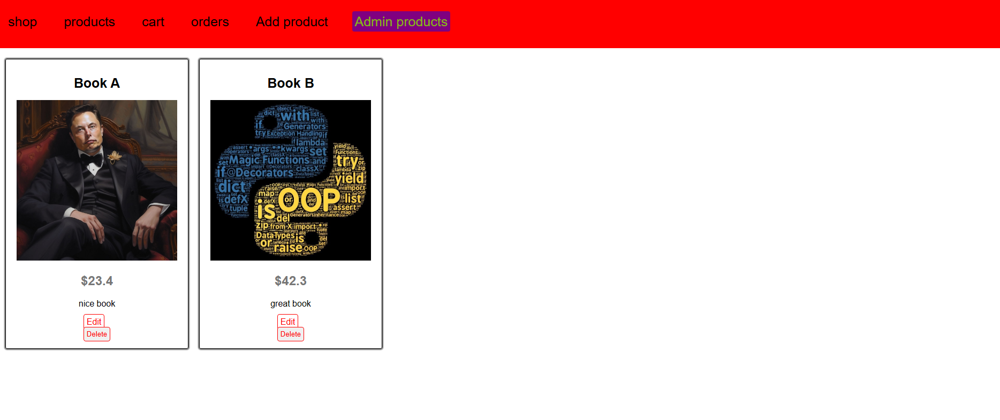

# 🛒 Node Shop - MongoDB Native Driver

A full-stack e-commerce web application built with **Node.js**, **Express.js**, **EJS**, and the **MongoDB Native Driver**.

This project demonstrates building an online shop using the MVC architecture without using an ODM like Mongoose. It includes product management, shopping cart functionality, and order processing while interacting directly with MongoDB.

---
## 🌐 Live Demo
[Click Here](node-shop-mongodb-driver-production.up.railway.app)
---
## 📸 Screenshots



## 🚀 Features

### 🛍️ Shop

* Display all available products
* View product details
* Add products to cart
* Increase product quantity automatically when adding the same product
* Remove products from cart
* Create orders from the shopping cart
* View previous orders

### 🔧 Admin Panel

* Add new products
* Edit existing products
* Delete products
* View all products in admin dashboard

### ⚙️ Backend

* MVC architecture
* Express.js routing
* Server-side rendering with EJS
* MongoDB Native Driver integration
* ObjectId-based relationships
* Asynchronous database operations using Promises
* Custom 404 error handling

---

## 🛠️ Technologies Used

* **Node.js**
* **Express.js**
* **MongoDB**
* **MongoDB Native Driver**
* **EJS Template Engine**
* **HTML5**
* **CSS3**
* **JavaScript (ES6)**

---

## 📂 Project Structure

```
node-shop-mongodb-driver
│
├── controllers/
│   ├── admin.js
│   ├── shop.js
│   └── error.js
│
├── models/
│   ├── product.js
│   └── user.js
│
├── routes/
│   ├── admin.js
│   └── shop.js
│
├── util/
│   └── database.js
│
├── views/
│   ├── admin/
│   └── shop/
│
├── public/
│   └── css/
│
├── app.js
├── package.json
└── package-lock.json
```

---

## 🗄️ Database Design

The application uses MongoDB with three main collections:

### Products Collection

Stores product information:

```javascript
{
  title,
  price,
  imageUrl,
  description,
  userId
}
```

---

### Users Collection

Stores user data and shopping cart:

```javascript
{
  userName,
  email,
  cart: {
    items: [
      {
        productId,
        quantity
      }
    ]
  }
}
```

---

### Orders Collection

Stores completed orders:

```javascript
{
  items,
  user: {
    _id,
    name
  }
}
```

---

## ⚙️ Installation

Clone the repository:

```bash
git clone https://github.com/sherift911/node-shop-mongodb-driver.git
```

Navigate to the project directory:

```bash
cd node-shop-mongodb-driver
```

Install dependencies:

```bash
npm install
```

Create a `.env` file:

```env
MONGO_USER=your_username
MONGO_PASSWORD=your_password
```

Start the application:

```bash
node app.js
```

The application will run on:

```
http://localhost:5000
```

---

## 🔐 Environment Variables

This project uses environment variables to protect sensitive database credentials.

Required variables:

| Variable       | Description      |
| -------------- | ---------------- |
| MONGO_USER     | MongoDB username |
| MONGO_PASSWORD | MongoDB password |

---

## 📚 What I Learned

Through this project, I practiced:

* Building a complete Node.js application using Express
* Applying MVC architecture
* Working directly with MongoDB Native Driver
* Performing CRUD operations
* Managing relationships using MongoDB ObjectId
* Implementing shopping cart logic
* Creating order workflows
* Handling asynchronous operations with Promises
* Organizing backend code into controllers, routes, and models

---

## 🔮 Future Improvements

* Add user authentication and authorization
* Improve responsive design
* Add input validation
* Add image upload functionality
* Add product search and filtering
* Add pagination
* Add payment integration
* Refactor the project using Mongoose

---


---

## 📄 License

This project was created for educational purposes while learning Node.js, Express.js, and MongoDB.
